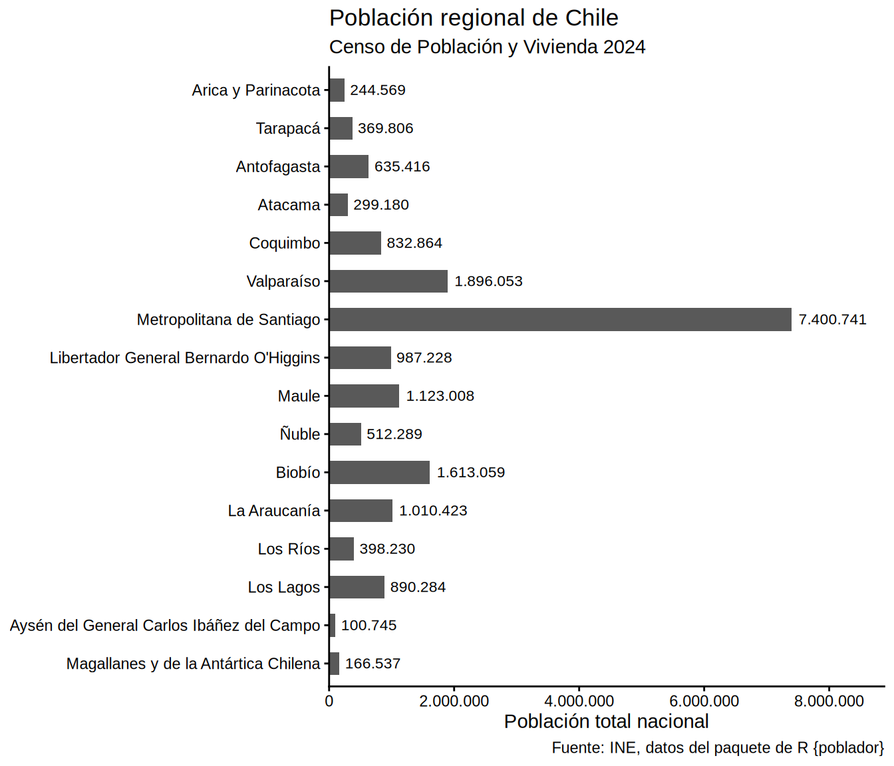
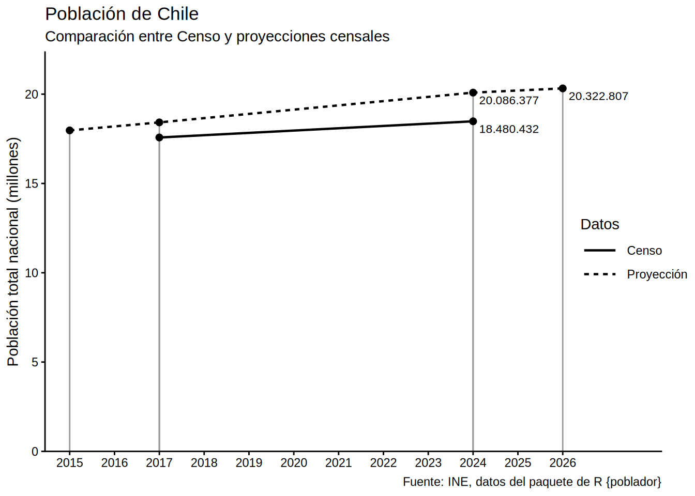

# Introducción al paquete

``` r

library(poblador)
library(dplyr)
```

## Gráfico de población regional de Chile

``` r

pob_regional <- poblador::censo_poblacion_2024 |> 
  group_by(nombre_region, codigo_region) |> 
  summarize(poblacion = sum(poblacion)) |> 
  ungroup() |> 
  territorial::ordenar_regiones(invertir = TRUE)
```

    `summarise()` has regrouped the output.
    ℹ Summaries were computed grouped by nombre_region and codigo_region.
    ℹ Output is grouped by nombre_region.
    ℹ Use `summarise(.groups = "drop_last")` to silence this message.
    ℹ Use `summarise(.by = c(nombre_region, codigo_region))` for per-operation
      grouping (`?dplyr::dplyr_by`) instead.

``` r

library(ggplot2)
library(scales)

pob_regional |> 
  ggplot() +
  aes(x = poblacion, y = nombre_region) +
  geom_col(width = .6) +
  geom_text(
    aes(label = label_comma(big.mark = ".")(poblacion)),
    hjust = -0.1, size = 3
  ) +
  scale_x_continuous(
    labels = label_comma(big.mark = "."),
    expand = expansion(c(0, 0.2))
  ) +
  labs(title = "Población regional de Chile",
       subtitle = "Censo de Población y Vivienda 2024",
       caption = "Fuente: INE, datos del paquete de R {poblador}",
       x = "Población total nacional", y = NULL) +
  theme_classic(base_family = "Arial")
```



## Gráfico de población nacional de Chile

``` r

pob_2017 <- poblador::censo_poblacion_2017 |> 
  mutate(tipo = "Censo")

pob_2024 <- poblador::censo_poblacion_2024 |> 
  mutate(tipo = "Censo")

pob_2026 <- poblador::censo_poblacion_proyeccion |> 
  filter(año %in% c(2015, 2017, 2024, 2026)) |> 
  mutate(tipo = "Proyección")
```

``` r

datos <- bind_rows(
  pob_2017,
  pob_2024,
  pob_2026
)

datos_anual <- datos |> 
  group_by(año, tipo) |> 
  summarize(poblacion = sum(poblacion))
```

``` r

library(ggplot2)
library(scales)

datos_anual |> 
  ggplot() +
  aes(año, poblacion,
      linetype = tipo) +
  geom_segment(
    aes(xend = año, yend = 0),
    linetype = "solid", linewidth = 0.5,
    color = "#999999") +
  geom_line(linewidth = .8) +
  geom_point(size = 2) +
  geom_text(
    data = ~filter(.x, año %in% c(2024, 2026)),
    aes(label = label_comma(big.mark = ".")(poblacion)),
    hjust = -0.1, vjust = 1.5, size = 3
  ) +
  scale_y_continuous(
    labels = label_comma(scale = 1e-6, big.mark = "."),
    expand = expansion(c(0, 0.1))
  ) +
  scale_x_continuous(
    breaks = seq(min(datos_anual$año), max(datos_anual$año)),
    expand = expansion(c(.05, .2))
  ) +
  labs(title = "Población de Chile",
       subtitle = "Comparación entre Censo y proyecciones censales",
       caption = "Fuente: INE, datos del paquete de R {poblador}",
       linetype = "Datos",
       y = "Población total nacional (millones)", x = NULL) +
  theme_classic(base_family = "Arial") +
  theme(legend.key.width = unit(1, "cm"),
        legend.margin = margin(l = -70))
```


